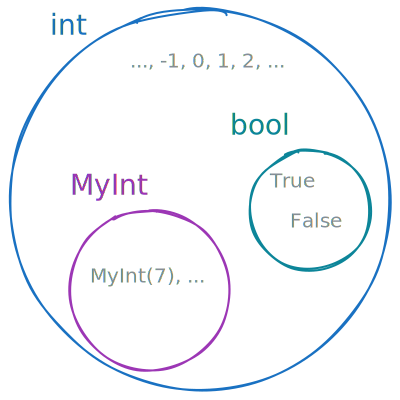
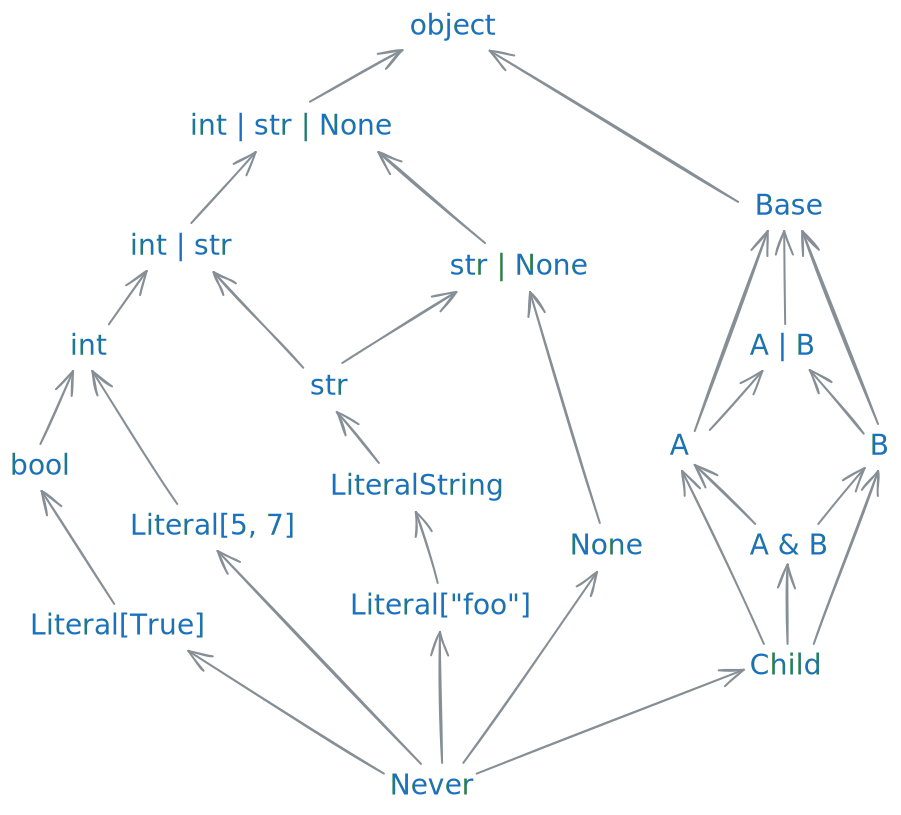
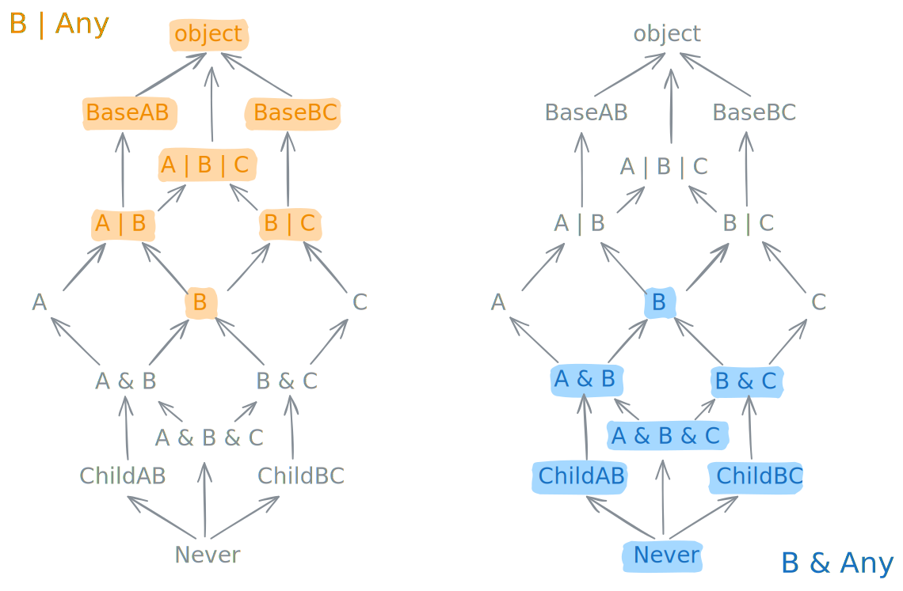

# Set-theoretic gradual types

This article explores the fundamental structure of Python's type system, and explains how it helps in
modeling the inherently dynamic nature of the language. We will start by describing the *set-theoretic
foundation* on fully static types, and then expand to *gradual types* later.
The goal of this article is to provide a framework that helps you to work with and think about
Python types. You will learn what union and intersection types are, what a type like `int & Any`
means, and how to determine if it is assignable to `bool | Any`.

## Set-theoretic structure

{ width="250", align="right" }

You can think of fully static types as sets of Python objects. The set that corresponds to the type `int`,
for example, contains all possible integer values that are representable in Python, but it also contains
`True` and `False`, and all instances of every other subclass of `int`. Two special types are worth calling
out. The type `object` represents the set of *all* possible Python objects. In set theory, this is called
the *universal set*. Type theory calls it the **top type**. On the other end of the spectrum, we have the
**bottom type** `Never`, represented by the empty set $\emptyset$. Next, we can also define relationships between
types. We say that a type `S` is a **subtype**
of type `T` if the corresponding sets follow the subset relation $S \subseteq T$. Conversely, we call `T` a supertype of `S`.
`Never` is a subtype of all types, while `object` is a supertype of all types. For fully static types, subtyping
is the same as **assignability**: You are allowed to pass a value of type `bool` to a function expecting an `int`, because the set
$\{\mathbf{True}, \mathbf{False}\}$ is a subset of the set describing `int`.
Finally, we can use set-theoretic operations to create new types. In a Python type annotation, you can use the
syntax `int | str` to construct a **union type** that corresponds to the set $\mathbf{int} \cup \mathbf{str}$.
The individual elements of a union `A` and `B` are always subtypes of the union type `A | B`. A union with `object` always
results in `object`. A union with `Never` is a no-op. The union `A | B` of two types is the least upper
bound of `A` and `B` under the subtyping relation. On the right side of the following illustration you can see what this
means: all common supertypes of `A` and `B` (like `Base` and `object`) are also supertypes of their union.

<figure markdown="span">
{ width="600" }

<figcaption>Some fully static types, partially ordered by subtyping.<br>
<code>class A(Base)</code> and <code>class B(Base)</code> are subtypes of a common <code>Base</code>,
and <code>class Child(A, B)</code> inherits from both <code>A</code> and <code>B</code></figcaption>
</figure>

We can also define **intersection types**. There is currently no special syntax for this in
Python, but we will use the notation `A & B` to refer to the type that corresponds to the set $\mathbf{A} \cap \mathbf{B}$.
Intersections are dual to unions. They have a very similar structure, but everything is reversed: the order of
subtyping, logical quantifiers like "any" and "all", as well as the role of `object` and `Never`. The type `A & B` is a subtype of both `A` and `B`. An intersection with `Never`
always results in `Never`. An intersection with `object` is a no-op. The intersection `A & B` of two types is a
greatest lower bound: every common subtype of `A` and `B` is also a subtype of `A & B` (`Child` and `Never` in
the illustration above).

You might already know why **union** types are useful in a dynamic language like Python. They allow us to type-annotate
a function like the following, which is able to handle a single `Path` **or** a sequence of `Path`s:

```py
def delete_files(paths: Path | Sequence[Path]):
    if isinstance(paths, Path):
        paths = [paths]
    for path in paths:
        path.unlink()
```

Conversely, **intersection** types are useful to describe situations where you want the *combination* of two or more behaviors.
Type narrowing in ty is based on intersections. For example, notice how we can call `obj.serialize_json()` **and**
access the `obj.version` property in the following function:

```py
def as_json(obj: Serializable) -> str:
    if isinstance(obj, Versioned):
        # `obj` is now of type `Serializable & Versioned`
        return str({"data": obj.serialize_json(), "version": obj.version})
    else:
        return obj.serialize_json()
```

## Gradual types

In contrast to languages where every expression has a definitive type, Python follows a gradual typing approach. Developers
can opt in to more type safety by adding more type annotations, but it is not a requirement. Even in
the absence of type annotations, a type checker can still infer meaningful types in many cases, but
there are limitations. If a function parameter is not annotated, you are typically allowed to pass
in any value you like.

The way this works is by introducing a new primitive to the type system, the dynamic type `Any`.
Its name can be taken quite literally. It can represent *any* fully static type (like `int`, `list[bool]` or `str | None`).

<!-- intro graduial types -->

Define set theoretic operations on gradual types. The union
```
G1 | G2 = [m1 | m2, for m1 in G1, for m2 in G2]
```
* Symmetric? check
* Idempotent/Reflexive/…? i.e. is G1|G1 = G1?
  ```
  G1 | G1 = [m1 | m1' for m1, m1' in G1]
  ```
  Necessary condition:
    Is only reflexive if `m1 | m1' \elem G1` for all `m1, m1' in G1`.
    but we also need completeness: m1 | m1' needs to range over all of G1, i.e. for every m in G1,
    there exists m1, m1' in G1 such that m1|m1' = m


lower bound / bottom materialization
* for every m in G, bottom[G] <= m
* does bottom[·] distribute over unions?
    bottom[A | B] = bottom[A] | bottom[B]?


(strong) subtyping:
* G1 <= G2 if forall g1. forall g2. g1 <= g2
    top[G1] <= bottom[G2]
    reflexive? no (Any not a subtype of Any; in fact: only reflexive on fully static types)
    transitive? yes
    anti-symmetric?
assignability:
* G1 <= G2 if exists g1, g2. g1 <= g2
    bottom[G1] <= top[G2]
    same as subtyping for gradual types
    reflexive? yes
    transitive? no (str assignable to Any, and Any assignable to int, but str not assignable to int)
* weak subtyping(?): bottom[G1] <= bottom[G2] && top[G1] <= top[G2]
    * this relation can help define equivalence on gradual types
    * reflexive? yes
    * transitive? also yes

* what is this? G1 <= G2 forall g1. exists g2. g1 <= g2
* mutual assignability
  * bottom[G1] <= top[G2] && bottom[G2] <= top[G1]  =====> intervals overlap
  * reflexive? yes
  * transitive? no


redundancy: when is U | S = U, i.e. when is it redundant to add S to a union U?
  * we want to be able to simplify e.g. list[Any] | list[Any] to list[Any]
  * if U | S and U are equivalent, i.e. if
  * bottom[U | S] == bottom[U] AND top[U | S] == top[U]
  * if U|S is a weak subtype of U and vice versa


things that break down if gradual types are not intervals:
* G|G != G
* G&G != G
* what would bottom[G]/top[G] even be?!


<figure markdown="span">

{ width="600" }

<figcaption>Visualizations of the gradual types <code>B | Any</code> and <code>B & Any</code>, showing how they act like lower and upper bounds, respectively.</figcaption>
</figure>

<!-- TODO

- explain top/bottom materialization
- visually show subtyping and assignability / equivalence
  - table with properties
  - show examples which are assignable, but not subtype etc.
  - show which relation implies another
- precision relation?
- negation types? Jelle's article
- Smallest possible gradual type that includes int and str: (int | str) & Any. or maybe use two
  final classes to demonstrate that more clearly?
- meant to compliment the [type system concepts page](https://typing.python.org/en/latest/spec/concepts.html)
- focus on intuitive understanding (and practical applications?)
- "more visual"
- Literature (Jelle negation types, type system concepts, gradual typing literature, Elixir?, Kotlin?)
- Intersections:
    - https://github.com/astral-sh/ty/issues/2229#issuecomment-4282138870
    - hasattr narrowing
    - isinstance(…, dict)
    - setting attributes on functions
- discuss invariant generics

!!! info

    Intersection types have interesting applications. If you are curious to try them out, ty has first-class support
    for representing them and for using them in type annotations. You can read more about their applications
    [in this section](../features/type-system.md#intersection-types), which also links to some interactive demos.

-->
